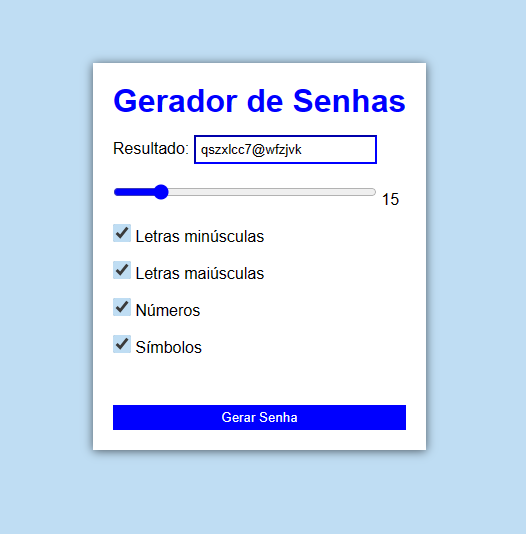

<h1 align="center"> Gerador de Senha com JavaScript </h1>

 

  

## 🚀 Tecnologias

Esse projeto foi desenvolvido com as seguintes tecnologias:

- HTML e CSS
- JavaScript
- Git e Github

## 💻 Projeto

Gerador de senhas usando algoritmos para criar senhas aleatórias com base em uma combinação de caracteres, números e símbolos para gerar senhas fortes e seguras.

